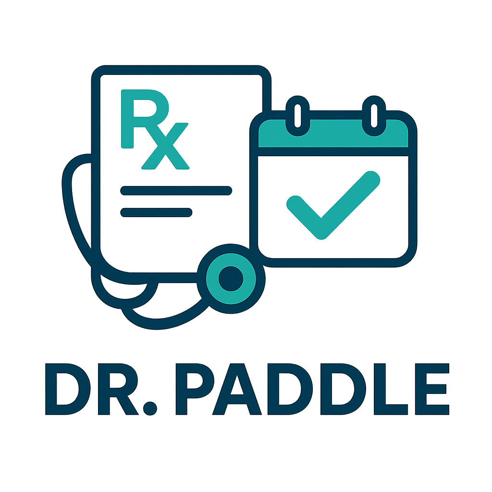

<p align="center">
  
</p>

# Dr. Paddle

An intelligent application that digitizes handwritten doctor notes and prescriptions using PaddleOCR, then automatically creates Google Calendar events to help patients never miss their medications or appointments.

## Problem

Patients often receive handwritten prescriptions and medical instructions that are:
- Difficult to read and interpret
- Easy to forget or lose
- Not integrated with digital reminder systems

This leads to missed medications, forgotten follow-up appointments, and poor adherence to treatment plans.

## Solution

Dr. Paddle bridges the gap between paper-based medical instructions and digital reminder systems:

1. **Capture** - Take a photo of your prescription or doctor's notes
2. **Recognize** - PaddleOCR extracts text from handwritten medical documents
3. **Parse** - AI interprets medication names, dosages, frequencies, and appointment dates
4. **Schedule** - Automatically creates Google Calendar events with proper reminders

## Features

- **Handwriting Recognition** - Powered by PaddleOCR for accurate text extraction from medical documents
- **Smart Parsing** - Understands medical terminology, dosage instructions, and scheduling patterns
- **Calendar Integration** - Seamless Google Calendar event creation with customizable reminders
- **Medication Reminders** - Never miss a dose with recurring calendar events
- **Appointment Tracking** - Keep track of follow-up visits and medical appointments

## API

| Method | Endpoint | Description |
|--------|----------|-------------|
| `POST` | `/api/recognize` | Trigger OCR recognition on current image |
| `GET` | `/api/current` | Get current captured image (JPEG) |

### Response format for `/api/recognize`

```json
{
  "takings": [
    {
      "name": "Amoxicillin 500mg, day 1/3",
      "start": "2025-11-30T10:00:00",
      "description": "Take 1 capsule with food"
    },
    ...
  ]
}
```

## Tech Stack

- **Backend**: FastAPI (Python)
- **OCR Engine**: PaddleOCR
- **Calendar**: Google Calendar API
- **AI/ML**: Text parsing and medical instruction interpretation

## Project Structure

```
.
├── assets/           # Images and static assets
│   └── logo.png      # Project logo
├── backend/          # FastAPI backend server
│   ├── api/          # API endpoints
│   ├── services/     # Business logic services
│   ├── demo/         # Demo images for testing
│   ├── main.py       # Application entry point
│   └── README.md     # Backend setup instructions
└── README.md         # This file
```

## Getting Started

See [backend/README.md](backend/README.md) for setup and running instructions.

## License

See [LICENSE](LICENSE) for details.
